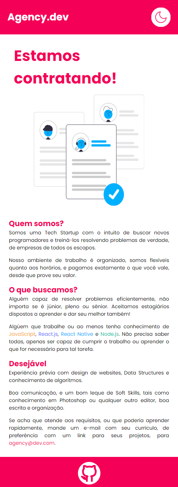

<h1 align="center">Agency.dev</h1>

<h4 align="center">Uma página com requisitos e informações sobre uma Tech Startup, que no momento está contratando.</h3>

</img>

---

## :bookmark_tabs: Tabela de Conteúdo

<!-- @import "[TOC]" {cmd="toc" depthFrom=1 depthTo=6 orderedList=false} -->

<!-- code_chunk_output -->

- [:bookmark_tabs: Tabela de Conteúdo](#bookmark_tabs-tabela-de-conteúdo)
- [:hammer: Tecnologias Utilizadas](#hammer-tecnologias-utilizadas)
- [:handshake: Seja um contribuidor](#handshake-seja-um-contribuidor)
- [:camera: Screenshots do site](#camera-screenshots-do-site)
- [:books: Licença](#books-licença)

<!-- /code_chunk_output -->

---

## :hammer: Tecnologias Utilizadas 
Para desenvolver este site, usei as seguintes tecnologias:
- HTML
- SCSS
- JavaScript

---

## :handshake: Seja um contribuidor
Tem alguma ideia que poderia alavancar ainda mais o projeto, e deseja implementar? É simples! 
- Faça um fork do projeto
- Modifique o que achar necessário
- Faça o commit das mudanças
- Crie um Pull Request

---

## :camera: Screenshots do site

---

## :books: Licença
Este projeto está sob [licença MIT](https://choosealicense.com/licenses/mit/).  
Clique no link ou veja o arquivo [LICENSE](./LICENSE) para mais detalhes.